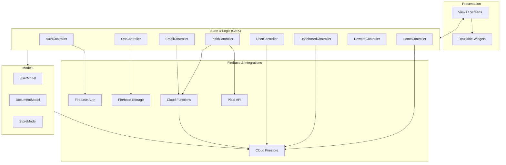
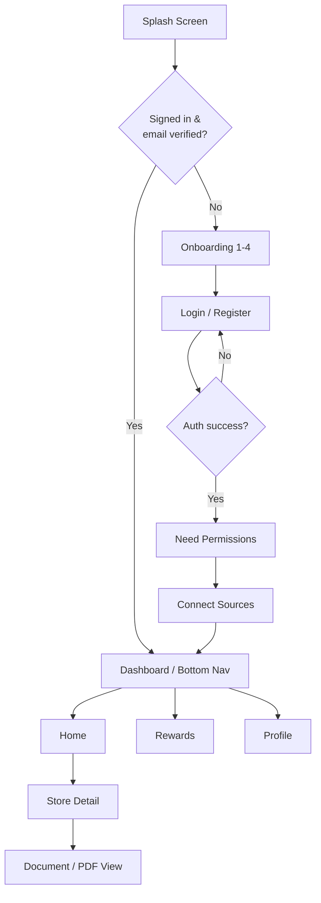
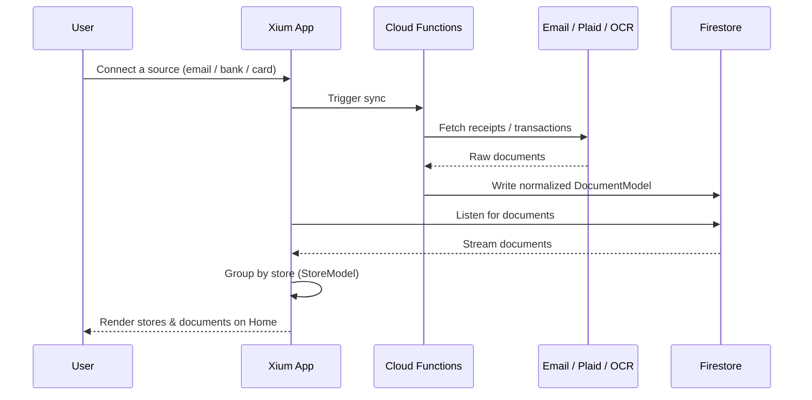

# Xium App

Xium is a Flutter application that aggregates a user's receipts and documents from
multiple sources — email, bank transactions (Plaid), phone/SMS, and loyalty cards —
and organizes them by store so they're searchable in one place. It is built with the
[GetX](https://pub.dev/packages/get) state-management/navigation stack and backed by
Firebase (Auth, Firestore, Storage) plus Cloud Functions.

## Tech Stack

| Layer            | Technology                                                        |
| ---------------- | ----------------------------------------------------------------- |
| UI / Framework   | Flutter (Dart `^3.8.1`), Material, custom Satoshi fonts           |
| State & Routing  | GetX (`get`), `get_storage` for local persistence                 |
| Auth             | Firebase Auth, Google Sign-In, Sign in with Apple                 |
| Data             | Cloud Firestore, Firebase Storage                                 |
| Integrations     | Plaid (`plaid_flutter`), `flutter_web_auth_2`, `image_picker`     |
| Backend          | Firebase Cloud Functions (Node.js, in `functions/`)               |
| Other            | `flutter_svg`, `flutter_animate`, `flutter_spinkit`, `shimmer`    |

## Project Structure

```
lib/
├── main.dart              # App entry point, Firebase + GetStorage init
├── firebase_options.dart  # Generated Firebase config
├── constants/             # Colors, fonts, translations (en/fr)
├── controller/            # GetX controllers (business logic)
├── model/                 # Data models (User, Document, Store)
├── generated/             # Generated asset references
└── views/
    ├── screens/           # Feature screens (auth, home, profile, ...)
    └── widgets/           # Reusable UI widgets
functions/                 # Firebase Cloud Functions backend
```

## Architecture

Xium follows an MVC-style layering on top of GetX: views render reactive state,
controllers hold the logic, and models map to Firebase data.



## Navigation Flow

On launch the splash screen checks the Firebase session and routes the user to
either the main dashboard (returning, verified user) or onboarding.



## Data Flow — Document Aggregation

Receipts and documents flow in from several connected sources, are normalized into
a single `DocumentModel`, grouped by store, and surfaced on the home screen.



## Getting Started

### Prerequisites

- [Flutter SDK](https://docs.flutter.dev/get-started/install) (Dart `^3.8.1`)
- A configured Firebase project (config is checked in via `firebase_options.dart`)
- For backend work: Node.js and the [Firebase CLI](https://firebase.google.com/docs/cli)

### Run the app

```bash
flutter pub get        # install Dart/Flutter dependencies
flutter run            # launch on a connected device or emulator
```

### Useful commands

```bash
flutter analyze        # static analysis / lints
flutter test           # run unit & widget tests
flutter build apk      # build a release Android APK
flutter build ios      # build for iOS (requires macOS/Xcode)
```

### Cloud Functions

```bash
cd functions
npm install
firebase emulators:start   # run functions locally
firebase deploy --only functions
```

## Localization

The app ships with English and French translations (see
`lib/constants/app_translators.dart`). The active locale is persisted with
`get_storage` and read on startup in `main.dart`.

## Contributing

1. Create a feature branch.
2. Run `flutter analyze` and `flutter test` before opening a PR.
3. Keep changes focused and follow the existing GetX controller/view conventions.
